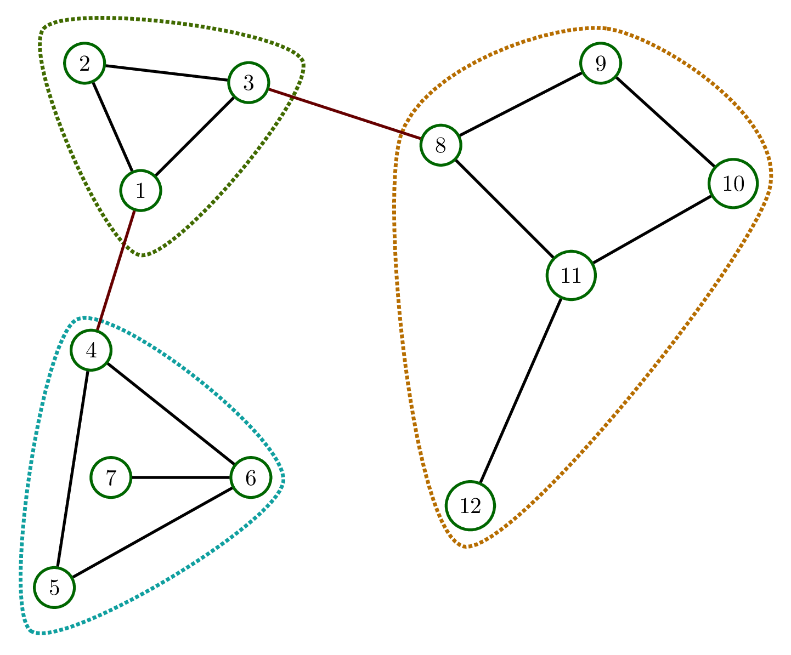
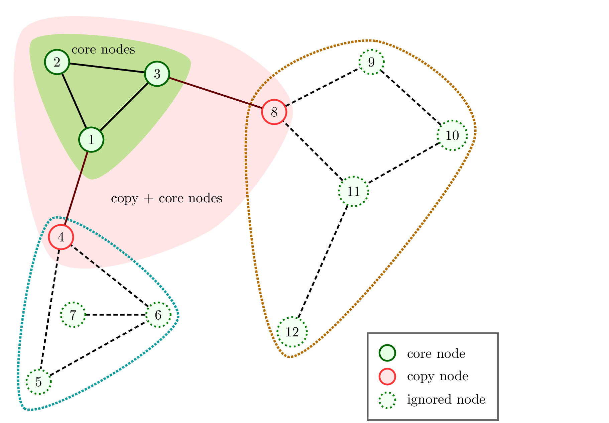
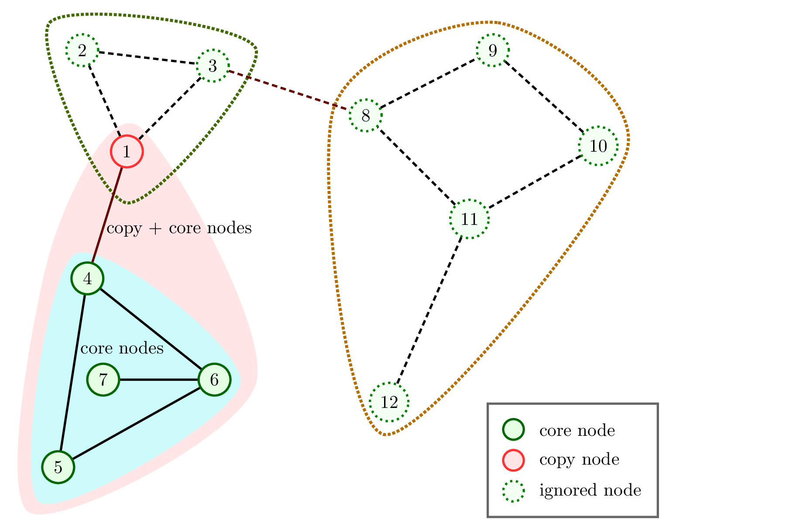

# Problem formulation

Here we present the mathematical formulation of the distributed power
flow problem, which simply reads

\[\begin{aligned}
        g^{\text{pf}}_i( x_i, z_i ) &= 0 \\
        g^{\text{bus}}_i ( x_i ) &= 0 \\
        \sum_{i = 1}^{n^{\text{reg}}} A_i \begin{bmatrix}
            x_i \\
            z_i
        \end{bmatrix}
        &= 0.
    \end{aligned}\]

In plain words, the first set of equations satisfies the power flow
equations in each region \(i\), the second set of equations accounts for
the bus specifications, and the third set of equations ensures consensus
among the nodes that are shared between regions (will be explained
below).

Its advantage is that its solution—supposing it exists—is mathematically
equivalent to the original power flow problem. Instead of often done
splitting of lines we simply copy neighboring buses within regions.

## Core nodes & copy nodes

Suppose we have a grid that looks like as follows

There are a total of \(12\) buses in the system. The dashed lines
indicate the three different regions: buses \(\{ 1, 2, 3 \}\) belong to
what we call the master system, buses \(\{4, 5, 6, 7 \}\) belong to what
we call the (first) slave system, and buses \(\{ 8, 9, 10, 11, 12 \}\)
belong to the (second) slave system. Hence, we distinguish between
*master* and *slave* systems; these local or regional systems (or just
*subsystems*) make up the overall power system.

For the overall system the power flow problem means to compute the
values

\[\begin{aligned}
    x_i = \begin{bmatrix}
        \theta_i \\
        v_i \\
        p_i \\
        q_i \\
    \end{bmatrix}
    \in \mathbb{R}^{4 n}\end{aligned}\]

for all \(i \in \{1, \dots, 12 \}\). A prototypical power flow problem
can be formulated mathematically as a system of nonlinear equations of
the form

\[\begin{aligned}
        g^{\text{pf}}( x) &= 0, \\
        g^{\text{bus}}( x) &= 0,
    \end{aligned}\]

where \(g^{\text{pf}}( x) = 0\) constitutes the \(2 \times 12\) power
flow equations, and \(g^{\text{bus}}( x) = 0\) stands for the remaining
\(2 \times 12\) bus specifications. This yields a total of
\(4 \times 12\) equations for \(4 \times 12\) unknowns. Arguably, this
leads to large systems of nonlinear equations as soon as the number of
buses in the power system increases. From here on we call this
prototypical power flow problem we just described the *centralized*
power flow problem.

The idea of *distributed* power flow is to solve *local* power flow
problems within each system (= the master system, and all of the slave
systems), independent of each other, and iterate for as long as
necessary until the solution of the centralized problem is obtained.
Iteration here means to find consensus on the physical values of the
exchanged power between the subsystems.

Before making this idea mathematically precise we introduce some more
Nomenclature. Suppose we are seated in the master system, the one
composed of buses \(\{1, 2, 3 \}\). From our perspective both slave
systems are our *neighbors*. More precisely, we know only that bus \(4\)
(located in the first slave system) is our connection to the first slave
system. Likewise, bus \(8\) (located in the second slave system) is our
connection to the second slave system. To distinguish between these
different kinds of buses we call the buses \(\{1, 2, 3 \}\) the *core*
nodes of the master system, and buses \(\{ 4, 8\}\) the *copy* nodes.
Importantly, all other nodes do not exist for us; they are ignored.
Graphically, our world looks as follows.

Why the term *copy*? Because when formulating the power flow equations
for the master system we need to know the voltages at the *copy* nodes.
And in case we don’t know the values (which we really don’t because the
copy nodes do not belong to our jurisdiction), then we have to *assume*
values for them. This can be thought of as copying the buses into the
shaded are denoted as “\(\text{copy + core nodes}\),” hence the name.

Taking on the perspective of the first slave system we see: our core
nodes are \(\{ 4, 5, 6, 7 \}\), and there is just one copy bus \(1\),
the first bus in the master system. Our world looks as follows.

Being able to distinguish between core nodes and copy nodes allows to
formulate the distributed power flow clearer: *solve the power flow
problem in each subsystem and attain consensus between the copy nodes
and their core node equivalents.* By core node equivalent we mean the
following: the first copy bus of the master system has bus \(4\) as its
core node equivalent. It is clear from intuition that if the voltage at
the copy node in each subsystem corresponds to the value of its core
node equivalent, then the solution of the distributed power flow problem
is the same as the solution from the centralized power flow problem.

Let us make these ideas mathematically more precise.

## Local power flow problem

The following table collects symbols and their meanings as they are used
throughout.

| Symbol                | Meaning                                    |
| :-------------------- | :----------------------------------------- |
| \(n^{\text{reg}}\)    | Number of regions                          |
| \(n^{\text{conn}}\)   | Number of connecting lines between regions |
| \(n^\text{core}_{i}\) | Number of core nodes in region \(i\)       |
| \(n^\text{copy}_{i}\) | Number of copy nodes in region \(i\)       |
| \(x_{i}\)             | State of core nodes in region \(i\)        |
| \(z_{i}\)             | State of copy nodes in region \(i\)        |

We compose the set of buses of each region \(i\) into a set of *core
nodes*, and a set of *copy nodes*. The core nodes are the original nodes
that make up the power system. The copy nodes are the nodes that connect
the power system to the neighboring power systems. Hence, the copy nodes
*do not belong to the power system* but to its neighbors. The sole
purpose of the copy nodes is to store the complex voltage information at
the neighboring buses such that power flow equations can be constructed.

The state of the core nodes contains the voltage angles, the voltage
magnitudes, the net active power, and the net reactive power of all core
nodes

\[\begin{aligned}
    \label{eq:state-core}
    x_i = \begin{bmatrix}
        \theta_i^\text{core} \\
        v_i^\text{core} \\
        p_i^\text{core} \\
        q_i^\text{core} \\
    \end{bmatrix}
    \in \mathbb{R}^{4 n^\text{core}_i}.\end{aligned}\]

The state of the copy nodes contains the voltage angles and the voltage
magnitudes of all copy nodes

\[\begin{aligned}
    \label{eq:state-copy}
    z_i = \begin{bmatrix}
        \theta_i^\text{copy} \\
        v_i^\text{copy}
    \end{bmatrix}
    \in \mathbb{R}^{2 n^\text{copy}_i}.\end{aligned}\]

We see: each region \(i\) is described by a total of
\(4 n^\text{core}_i + 2 n^\text{copy}_i\) real numbers.

### Power flow equations

In region \(i\) we formulate a total of \(2 n^\text{core}_i\) power flow
equations
\(g^{\text{pf}}_i \colon \mathbb{R}^{4 n^\text{core}_i} \times \mathbb{R}^{2 n^\text{copy}_i} \rightarrow \mathbb{R}^{2 n^\text{core}_i}\)
for all core nodes

\[\begin{aligned}
    g^{\text{pf}}_i( x_i, z_i) = 0.\end{aligned}\]

### Bus specifications

In region \(i\) we formulate a total of \(2 n^\text{core}_i\) bus
specifications
\(g^{\text{bus}}_i \colon \mathbb{R}^{4 n^\text{core}_i} \rightarrow \mathbb{R}^{2 n^\text{core}_i}\)
for all core nodes

\[\begin{aligned}
    g^{\text{bus}}_i( x_i) = 0.\end{aligned}\]

### Degrees of freedom

Subtracting the number of equations from the number of decision
variables gives us a total of

\[\begin{aligned}
    \underbrace{4 n^\text{core}_i + 2 n^\text{copy}_i}_{\text{Decision variables}} - \underbrace{2 n^\text{core}_i}_{\text{Power flow equations}} - \underbrace{2 n^\text{core}_i}_{\text{Bus specifications}} = \underbrace{2 n^\text{copy}_i}_{\text{Degrees of freedom}}\end{aligned}\]

degrees of freedom for each region \(i\). These degrees of freedom must
be fixed globally by the consensus constraints.

## Decentralized power flow problem

\[\begin{aligned}
        g^{\text{pf}}_i( x_i, z_i ) &= 0 \\
        g^{\text{bus}}_i ( x_i ) &= 0 \\
        \sum_{i = 1}^{n^{\text{reg}}} A_i \begin{bmatrix}
            x_i \\
            z_i
        \end{bmatrix}
        &= 0,
    \end{aligned}\]

where the consensus matrices
\(A_i \in \mathbb{R}^{4 n^{\text{conn}}\times (4 n^\text{core}_i + 2 n^\text{copy}_i)}\)
enforce equality of the voltage angle and the voltage magnitude at the
copy buses and their respective original buses.
