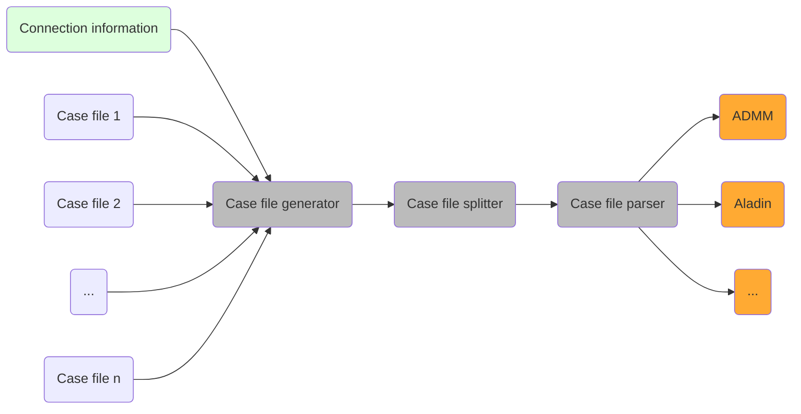
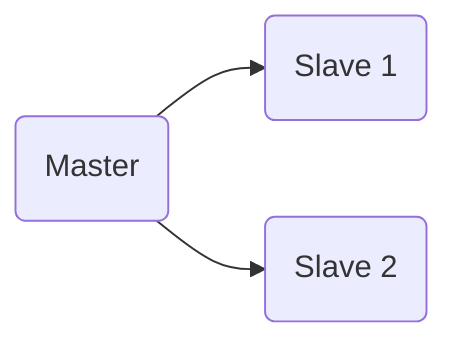
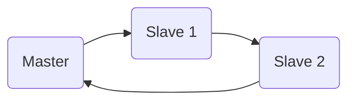

# Morenet -- Documentation

The code consists of
- a case file generator,
- a case file splitter, and
- a case file parser.

Their relation is shown below.



## Modeling assumptions
- We distinguish between a *master system* and several *slave systems*. 
### Case file generator
- The slack bus of the *master system* is the slack bus of the overall system. 
- Systems can be connected in arbitrary ways at generation buses, for instance:



There may be several connections between two systems too.

- In the *to*-system we replace the generation bus by a `PQ` bus with zero generation and original demand.
  - If the connecting generation bus in the *to*-system is the slack bus, then this slack in the distribution system is replaced by a `PQ` bus with zero generation/demand.
  - On the other hand, if the connecting generationbus in the *to*-system is a `PV` bus, then this `PV` bus is replaced by a `PQ` bus, and the slack bus in the distribution system is replaced by a `PV` bus.
- If the transmission system has $`N_{TS}`$ nodes, and if each distribiution system $i$ has $`N_{DS, i}`$ nodes for $`i \in \{ 1, \dots, d \}`$, then the overall system is going to have $`N_{TS} + N_{DS_1} + \dots + N_{DS, d}`$ nodes.
- The entries for the generated active/reactive power from the fields `mpc.gen()` is ignored.
- The numbering of the overall system goes from $`1`$ to $`N`$, where $`N`$ is the number of buses in the combined system.
- The master system contains bus number $`1`$. The numbering of the remaining systems is done according to order of appearance.
- All case files have the same `baseMVA`.
- The voltage magnitude settings in `mpc.gen` must be equivalent.
- If there are several generators at a single bus, then their voltage magnitude must be the same. 

### Case file splitter
- The copy buses of each region $`i`$ are added at the end of the list of core buses of region $`i`$. Both the list of copy buses and the list of core buses are sorted in ascending order.
- The bus admittance matrix of region $`i`$ is created by first splitting the case for region $`i`$ including the copy buses, and then calling `makeYbus()` (built-in `matpower` function).

### Case file parser
- The distributed problem is obtained by copying buses at the connecting lines, and then enforcing consensus at the original buses and their respective copies.
- The state $`x_i`$ in every region $`i`$ is composed of $`n_{i}^{\text{core}}`$ *core entries* and $`n_{i}^{\text{copy}}`$ *copy entries*, where
```math
x_{i}^{\text{core}} = ( \theta_i^{\text{core}}, v_i^{\text{core}}, p_i^{\text{core}}, q_i^{\text{core}} ) \in \mathbb{R}^{4 n_{i}^{\text{core}}},
````
- and
```math
x_{i}^{\text{copy}} = ( \theta_i^{\text{copy}}, v_i^{\text{copy}}) \in \mathbb{R}^{2 n_{i}^{\text{copy}}}.
```

- The full state of region $`i`$ is $`x_i = (\theta_i^{\text{core}}, \theta_i^{\text{copy}}, v_i^{\text{core}}, v_i^{\text{copy}}, p_i^{\text{core}}, q_i^{\text{core}}) \in \mathbb{R}^{4 n_i^{\text{core}} + 2 n_i^{\text{copy}}}`$.
