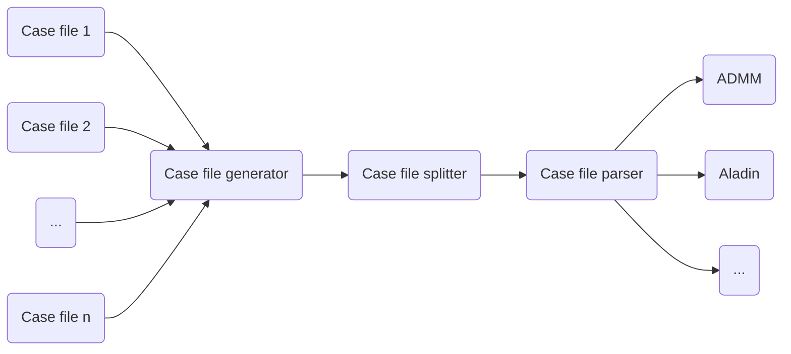

# Morenet -- Documentation

The code consists of
- a case file generator,
- a case file splitter, and
- a case file parser.

Their relation is shown below.

## Modeling assumptions

### Case file generator

| Assumption | File | Priority | Effect on code |
| --- | --- | --- | --- |
| The slack bus of the overall combined system is the original slack bus from the transmission system. |  | Low | Marginal |
| We connect each distribution system via a *generator* to a unique *generator* in the transmission system via a transformer.|  (replace_slack_and_generators.m)(01_generator/fun/mergefuns/replace_slack_and_generators.m)| High | Fair |
|- In the distribution system we replace the generation bus by a `PQ` bus with zero generation and original demand. - If the connecting generation bus in the distribution system is the slack, then this slack in the distribution system is replaced by a `PQ` bus with zero generation/demand. - On the other hand, if the connecting generation bs in the distribution system is a `PV` bus, then this `PV` bus is replaced by a `PQ` bus, and the slack bus in the distribution system is replaced by a `PV` bus.| (replace_slack_and_generators.m)(01_generator/fun/mergefuns/replace_slack_and_generators.m)| High | Fair |
|If the transmission system has $N_{TS}$ nodes, and if each distribiution system $i$ has $N_{DS, i}$ nodes for $i \in \{ 1, \dots, d \}$, then the overall system is going to have $N_{TS} + N_{DS_1} + \dots + N_{DS, d}$ nodes. |
| If the transmission system has $M_{TS}$ branches, and if each distribution system $i$ has $M_{DS, i}$ branches for $i \in \{ 1, \dots, d \}$, then the overall system is going to have $M_{TS} + M_{DS, 1} + \dots + M_{DS, d} + d$ branches.|
|Do not consider the generated active/reactive power in the fields `mpc.gen()`.|
|The transmission system is the first region, and the $i$-th distribution system is the $(i+1)$-st region.|
|The numbering of the overall system goes from $1 to N$, where $N$ is the number of buses in the combined system.|
|All case files have the same `baseMVA`.| | Low | Marginal |
|The voltage magnitude settings in `mpc.gen` must be equivalent.| | Low | Marginal |
| When there are several generators at a single bus, their voltage magnitude must be the same. | check-voltage_magnitudes.m | low | marginal |
| Cost functions must either linear or quadratic. | | low |

### Case file splitter

| Assumption | File | Priority | Effect on code |
| --- | --- | --- | --- |
| The numbering of the overall system goes from `1 to N`, where `N` is the number of buses in the combined system.|
| We create the bus admittance matrix of region $i$ by first creating a split case file for region $i$ including the copy buses, and then calling `makeYbus()` (built-in `matpower` function). | | |

### Case file parser
| Assumption | File | Priority | Effect on code |
| --- | --- | --- | --- |
| The distributed problem is obtained by copying buses at the connecting lines, and then enforcing consensus at the original buses and its respective copy. |
| The state $x_i$ in every region $i$ is composed of $n_{i}^{\text{core}}$ *core entries* and $n_{i}^{\text{copy}}$ *copy entries*, where $x_{i}^{\text{core}} = ( \theta_i, v_i, p_i, q_i ) \in \mathbb{R}^{4 n_{i}^{\text{core}}}$, and $x_{i}^{\text{copy}} = ( \theta_i, v_i) \in \mathbb{R}^{2 n_{i}^{\text{copy}}}$. |
| The *copy entries* are stacked below the *core entries*. |
